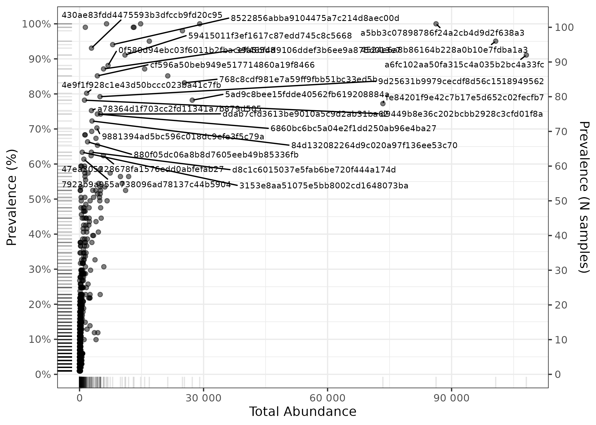
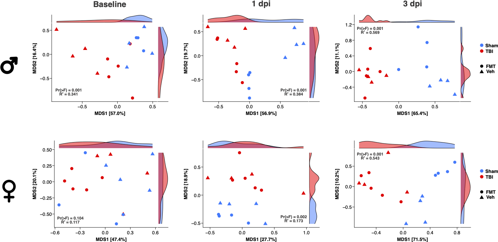
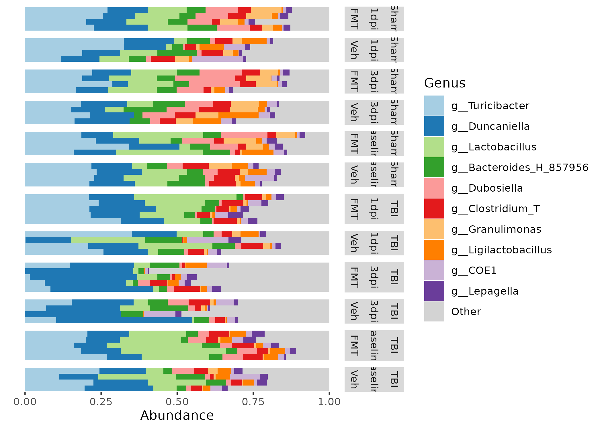
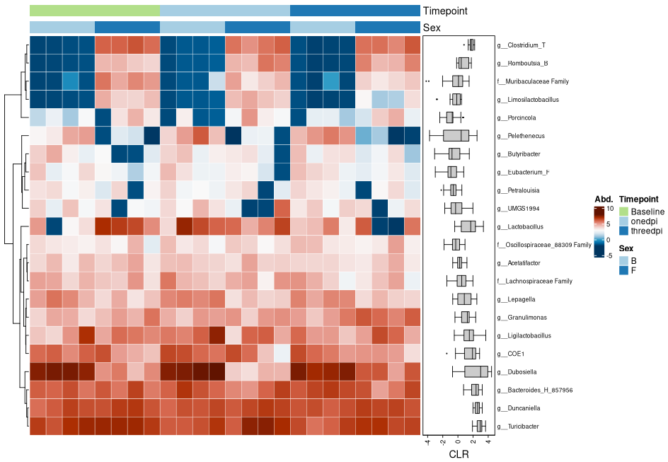
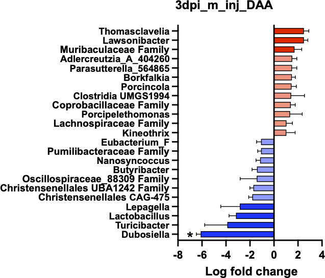
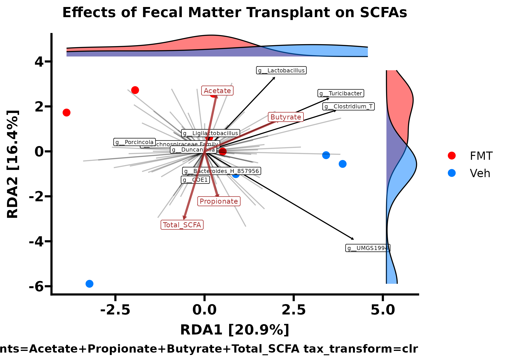

## Introduction

## Change intro paragraph

This vignette contains all of the code necessary for the microbiome analysis within our paper named "Exploring the effects of fecal microbiota transplantation on neuroinflammation after traumatic brain injury in Alzheimers disease mice". In this study, we researched the relationship between antibiotics, traumatic brain injury, and the gut microbiome. The gut microbiome analysis of this study was performed through short-read 16S V1-V3 sequencing performed at Baylor College of Medicine with raw fastq data accessible at BioProject [PRJNA1220689](https://www.ncbi.nlm.nih.gov/bioproject/PRJNA1220689).

Much of the data and visualizations here had slight visual touching up in photoshop/coreldraw just to make them look _perf_ prior to submission, so if you see a difference between the figures produced here and those found within our paper that is why.

In the beginning of this markdown, we will perform all the steps needed to process short-read 16S data using [dada2](https://github.com/benjjneb/dada2), with a big shoutout to Dr. Ben Callahan for the beginning chunks of this from [STAMPS 2024 workshop](https://github.com/mblstamps/stamps2024).

## Load dependencies

```{r, eval=FALSE}
library(dada2)
library(dplyr)
library(janitor)
library(biomformat)
library(Biostrings)
library(tibble)
library(digest)
library(phyloseq)
library(ape)
library(phytools)
library(microViz)
library(ggplot2)
library(ggrepel)
library(ggprism)
library(ggsci)
library(forcats)
library(FSA)
library(ggsignif)
library(broom)
library(igraph)
library(visNetwork)
library(SpiecEasi)
library(progressr)
library(furrr); plan(multisession, workers = 36)
```

## Process fastq data with DADA2

More work similar to this can be found the [DADA2 tutorial](https://benjjneb.github.io/dada2/tutorial.html).

```{r, eval=FALSE}
# Where is the freshly downloaded data?
list.files()
path <- "/condo/neurobiome/tmhagm8/fmtad_noabx/fastqs"

# Read in the forward and reverse fastq file names
fnFs <- list.files(path, pattern="_R1_001", full.names=TRUE)
fnRs <- list.files(path, pattern="_R2_001", full.names=TRUE)
head(fnFs)

# Get the qualities of all samples
plotQualityProfile(fnFs)
plotQualityProfile(fnRs)

# Define the paths to filtered files we are going to create
filtFs <- file.path(path, "filtered", basename(fnFs)) 
filtRs <- file.path(path, "filtered", basename(fnRs))

# Perform filtering and trimming
out <- filterAndTrim(fnFs, filtFs, fnRs, filtRs, maxEE=2, 
                     trimLeft=c(17, 21), # REPLACE XXX/YYY with valid parameter choices
                     truncLen=c(275, 265),
                     multithread = TRUE) 
head(out)
```

__Plot errors and run DADA2__

```{r, eval=FALSE}
# Learn the error model from the filtered data.
errF <- learnErrors(filtFs, multi=TRUE)
errR <- learnErrors(filtRs, multi=TRUE)

# Visualize the error model. Points are observations, black line is fitted error model.`
plotErrors(errF, nominalQ = TRUE)
plotErrors(errR, nominalQ = TRUE)

# Run the DADA2 method using the fitted error model.
ddF <- dada(filtFs, errF, pool=FALSE, multi=TRUE)
ddR <- dada(filtRs, errR, pool=FALSE, multi=TRUE)
```

__Merging reads, make sequence table, and remove chimeras__

```{r, eval=FALSE}
# Merge the denoised forward and reverse reads together.
mm <- mergePairs(ddF, filtFs, ddR, filtRs, verbose=TRUE)
# Were most reads retained during merging. If not, why not?

# Construct a sequence table: rows are samples, columns are ASVs, values are abundances.
# ASVs (columns) are ordered by their summed abundance across all samples.
sta <- makeSequenceTable(mm)
dim(sta)

# Remove chimeric ASVs and construct a new chimera-free sequence table.
st <- removeBimeraDenovo(sta, multi=TRUE, verbose=TRUE)
sum(st)/sum(sta)

saveRDS(st, "fmt_ad_no_abx_st.rds")
```
__Sanity check__

```{r, eval=FALSE}
# Code derived from the dada2 tutorial: https://benjjneb.github.io/dada2/tutorial.html
getN <- function(x) sum(getUniques(x))
track <- cbind(out, sapply(ddF, getN), sapply(ddR, getN), sapply(mm, getN), rowSums(st))
colnames(track) <- c("input", "filtered", "denoisedF", "denoisedR", "merged", "nonchim")
rownames(track) <- basename(fnFs)
head(track)
```
__Assign taxonomy__

```{r, eval=FALSE}
# Assign taxonomy down to the genus level to these 16S ASVs.
tax <- assignTaxonomy(st, "/home/tmhagm8/scratch/dada2/gg2_2024_09_toSpecies_trainset.fa.gz",
                      multi=TRUE)
unname(head(tax)) # unname strips the long ASV rownames to make the printed output more readable
```

__Prepare phyloseq inputs__

```{r, eval=FALSE}
# Metadata file
samdf <- read.csv("/condo/neurobiome/tmhagm8/fmtad_noabx/fmt_ad_no_abx/data/final_metadata.csv",
                    check.names = FALSE, header = TRUE, row.names = 1)

# Remove "DPI" from the filenames
rownames(st) <- gsub("DPI", "", rownames(st))

# Now remove the read suffix for both R1 and R2 files
rownames(st) <- gsub("_R[12]_001\\.fastq\\.gz$", "", rownames(st))
```

__Make ASV fasta for phylogenetics__

```{r, eval=FALSE}
# lets make our rep-seqs.fasta file to process the ASV's with mafft and fasttree
# In 'dada2', the columns of 'st' are the unique ASV sequences.
seqs <- colnames(st)

# Create a short "ASV name" by MD5 hashing each sequence
asv_ids <- vapply(seqs, digest, FUN.VALUE = character(1), algo = "md5")

# Write out a FASTA file where:
# >asv_id
# SEQUENCE
output_fasta <- "rep-seqs.fasta"
fileConn <- file(output_fasta, "w")

for (i in seq_along(seqs)) {
  # Write a FASTA header (">...") followed by the actual sequence
  cat(">", asv_ids[i], "\n", seqs[i], "\n", sep = "", file = fileConn)
}

close(fileConn)
```


## Run MAFFT & FastTree in CLI

To create the phylogenetic tree of our ASV sequences I turned to using my SLURM HPC and ran the following script with the rep-seqs.fasta file we created above.
I created a conda environment that had MAFFT and FastTree installed to run this.

```{r, engine = 'bash', eval = FALSE}
#! /bin/bash

#SBATCH --time=04-00:00:00
#SBATCH --partition=defq
#SBATCH --mem=192GB
#SBATCH --mail-user=myemail@myemail.org
#SBATCH --mail-type=BEGIN,END,FAIL
#SBATCH --ntasks-per-node=64
#SBATCH --nodes=1
#SBATCH --job-name=sr_16S
#SBATCH --comment=sr_16S

module load mamba
mamba activate sr_16S

DIR="$PWD"

mafft --maxiterate 1000 --genafpair --thread 64 "$DIR/rep-seqs.fasta" > "$DIR/rep-seqs-aln.fasta"

FastTree -nt -gtr "$DIR/rep-seqs-aln.fasta" > "$DIR/rep-seqs.tree"
```

__Match ASV names__ 

This sometimes can be a bit funky, make sure to run the entire pipeline above so the md5's match.

```{r, eval=FALSE}
#Now lets make the ASV names match for the phyloseq merging with tree

# 'seqs' are the raw DNA sequences currently in colnames(st)
seqs <- colnames(st)

# For each sequence, compute the MD5 hash
hash_ids <- vapply(seqs, digest, FUN.VALUE = character(1), algo = "md5")

# Rename the columns of 'st'
colnames(st) <- hash_ids
head(colnames(st))

# Rename the tax df with ASV 
rownames(tax) <- hash_ids
```

__Make phyloseq object__

```{r, eval=FALSE}
# somethin
ps <- phyloseq(sample_data(samdf), otu_table(st, taxa_are_rows=FALSE), tax_table(tax))

# Now we read in the phylo tree computed by mafft/fasttree
tree <- read.tree("/condo/neurobiome/tmhagm8/fmtad_noabx/fmt_ad_no_abx/data/rep-seqs.tree")

# Root at midpoint or with a specified outgroup
rooted_tree <- phytools::midpoint.root(tree = tree)

# And add it to our phyloseq object
physeq <- merge_phyloseq(ps, phy_tree(rooted_tree))

# Add the ASV sequences to the refseq phyloseq slot
dna <- DNAStringSet(seqs)
names(dna) <- hash_ids  # must match the renamed colnames(st)
physeq <- merge_phyloseq(physeq, refseq(dna))

physeq <- physeq |>
  tax_fix()

saveRDS(physeq, "fmtad_noabx_dd2_gg2.rds")
```

## Diversity analyses and vizualization

Up to this point our work is solid, from here on out I want us to write some code chunks we can use for all 16S analyses. I implemented [MicroViz](https://github.com/david-barnett/microViz) for clr relative abundance and ordination plotting, and diversity estimations with the use of [ANCOMBC2](https://github.com/FrederickHuangLin/ANCOMBC) for differential abundance approximations.

__For all microbiome analyses__
How to pick a threshold? --> Depends on what analysis method you are filtering for!

* Alpha diversity = DO NOT FILTER
* Beta diversity = relevance of threshold depends on your distance measure
* Differential abundance testing = stringent filtering, prevalence >5%, >10%?

If you're unsure, check out the [MicroViz documentation](https://david-barnett.github.io/microViz/) or read some Amy Willis' [statdivlab](https://github.com/statdivlab) papers!

__Shannon Diversity Calculation__

We took the shannon_species value for each covariate and plotted the values in our Prism document.

```{r Shannon, eval=FALSE}

# Calculate Shannon
shan_data <- physeq |>
  ps_calc_diversity(rank = "unique", index = "shannon") |>
  samdat_tbl()

shan_filt <- shan_data |>
  select(Mouse_ID, Sex, Injury, Treatment, Timepoint, shannon_unique)

write.csv(shan_filt, file = "/condo/neurobiome/tmhagm8/fmtad_noabx/fmt_ad_no_abx/data/fmtad_noabx_shannon.csv")
```

__Chao1 Richness Calculation__

Same thing this time except using the Chao1 index

```{r Chao1, eval=FALSE}
# Calculate Chao1 richness
chao1_data <- physeq |>
  ps_calc_richness(rank = "unique", index = "chao1") |>
  samdat_tbl()

chao1_filt <- chao1_data |>
  select(Mouse_ID, Sex, Injury, Treatment, Timepoint, chao1_unique)

write.csv(chao1_filt, file = "/condo/neurobiome/tmhagm8/fmtad_noabx/fmt_ad_no_abx/data/fmtad_noabx_chao1.csv")
```

__Intro to beta diversity__

This is useful for seeing where we want to filter our data for beta diversity (only light filtering).

```{r, eval=FALSE}
# gotta start of with read filtering
physeq |>
  ps_mutate(reads = sample_sums(physeq)) |> #this will get you read depth!
  samdat_tbl() |>
  ggplot(aes(x = reads)) +
  geom_freqpoly(bins = 100) +
  geom_rug(alpha = 0.5) +
  scale_x_log10(labels = scales::label_number()) +
  labs(x = "Number of classified reads", y = NULL) +
  theme_bw()

# lets find where we should filter our data
ps_Stats <- tibble(
  taxon = taxa_names(physeq),
  prevalence = microbiome::prevalence(physeq),
  total_abundance = taxa_sums(physeq)
)

# plot 
p <- ps_Stats |>
  ggplot(aes(total_abundance, prevalence)) +
  geom_point(alpha = 0.5) +
  geom_rug(alpha = 0.1) +
  scale_x_continuous(
    labels = scales::label_number(), name = "Total Abundance"
  ) +
  scale_y_continuous(
    labels = scales::label_percent(), breaks = scales::breaks_pretty(n = 9),
    name = "Prevalence (%)",
    sec.axis = sec_axis(
      trans = ~ . * nsamples(physeq), breaks = scales::breaks_pretty(n = 9),
      name = "Prevalence (N samples)"
    )
  ) +
  theme_bw()

# and add the taxa labels 
p + ggrepel::geom_text_repel(
  data = function(df) filter(df, total_abundance > 1e9 | prevalence > 0.6),
  mapping = aes(label = taxon), size = 2.5, min.segment.length = 0, force = 15)

ggsave("div_stats.png", height = 5, width = 7, units = "in")

# these params were chosen as a compromise with Amy Willis' advice (STAMPS 2024)
```


Now we have an idea on how to filter our data for beta diversity analyses, we start by subsetting for Treatments then plot using weighted unifrac distance PCoA. We also compute the permanova values between groups which was added to the figure later using CorelDRAW.

```{r, eval=FALSE}
injury_colors <- c("Sham" = "#007bff", "TBI" = "#ff0000")

ps_base_m <- subset_samples(physeq, Timepoint == "Baseline" & Sex == "M")
ps_base_f <- subset_samples(physeq, Timepoint == "Baseline" & Sex == "F")

ps_1dpi_m <- subset_samples(physeq, Timepoint == "1dpi" & Sex == "M")
ps_1dpi_f <- subset_samples(physeq, Timepoint == "1dpi" & Sex == "F")

ps_3dpi_m <- subset_samples(physeq, Timepoint == "3dpi" & Sex == "M")
ps_3dpi_f <- subset_samples(physeq, Timepoint == "3dpi" & Sex == "F")

# Create the PCoA plot with custom colors
ps_base_f |>
  tax_filter(min_prevalence = 2 / 100, verbose = FALSE, min_total_abundance = 50) |>
  tax_transform(trans = "compositional", rank = "unique") |>
  dist_calc(dist = "wunifrac") |>
  ord_calc("PCoA") |>
  # Map Injury to color and Treatment to shape
  ord_plot(color = "Injury", shape = "Treatment", size = 4) +
  theme_prism() +
  ggtitle("Base Females by Treatment and Injury") +
  # Add side densities with fill mapped to Injury
  ggside::geom_xsidedensity(aes(fill = Injury), alpha = 0.5, show.legend = FALSE) +
  ggside::geom_ysidedensity(aes(fill = Injury), alpha = 0.5, show.legend = FALSE) +
  ggside::theme_ggside_void() +
  # Apply custom color palettes for fill and color
  scale_fill_manual(values = injury_colors) +  # For side densities
  scale_color_manual(values = injury_colors) +  # For points
  # Customize theme elements
  theme(
    axis.title.x = element_text(size = 14),
    axis.title.y = element_text(size = 14),
    axis.text.x  = element_text(size = 14),
    axis.text.y  = element_text(size = 14),
    plot.title   = element_text(size = 14)
  )


ggsave("beta_div/base_inj_f_wuni_pcoa.pdf", height = 5, width = 7, units = "in")

#recompute distance for permanova
treat_dists <- ps_3dpi_m  |>
  tax_filter(min_prevalence = 2 / 100, verbose = FALSE, min_total_abundance = 50) |>
  tax_transform(trans = "compositional", rank = "unique") |>
  dist_calc("wunifrac")

# the more permutations you request, the longer it takes
# but also the more stable and precise your p-values become
treat_perm <- treat_dists |>
  dist_permanova(
    seed = 1234, # for set.seed to ensure reproducibility of random process
    n_processes = 1, n_perms = 999, # you should use at least 999!
    variables = "Injury"
  )

# view the permanova results
treat_permdf <- perm_get(treat_perm) |> as.data.frame()
#write.table(treat_permdf, file ="/condo/neurobiome/tmhagm8/fmtad_noabx/fmt_ad_no_abx/data/beta_div/3dpi_inj_m_treat_wuni_pcoa_permanova.tsv", sep = "\t")
```
Here is the figure from our plots made in the script above.


## Relative abundance plots

Super useful to make your own palette and assign to certain taxa, this helps your viewers understand trends in this data. I altered this figure in coreldraw to widen it out and turn it vertically (with the facet labels).

```{r, eval=FALSE}
# Make your custom color palette
myPal <- tax_palette(
  data = physeq, rank = "Genus", n = 25, pal = "greenArmytage",
  add = c(Other = "gray")
)
tax_palette_plot(myPal)

ps_m = subset_samples(physeq = physeq, Sex == "M")
ps_f = subset_samples(physeq = physeq, Sex == "F")

ps_f |>
  comp_barplot(
    tax_level = "Genus", n_taxa = 10,
    taxa_order = sum,
    sample_order = "bray", bar_outline_colour = NA,
  ) +
  facet_grid(
    rows = vars(Injury, Timepoint, Treatment),
    scales = "free", space = "free" # these options are critically important!
  ) +
  coord_flip() +
  theme(axis.text.y = element_blank(), axis.ticks.y = element_blank())

ggsave("fmt_ad_relabund_f_genus.png", height = 5, width = 7, units = "in")
```



## Heatmaps of abundance data

Heatmap of abundance with treatment groups, this is a heavily filtered subset but is needed for this type of figure. I prettied this up in coreldraw just by removing the legend and changing the order of the samples. Was not used in our manuscript but still nice to have

```{r, eval=FALSE}
# The lazy way of getting this formatted properly is to rename the vars in the alphabetical order
# ex) mice labelled M for Males to B for boys lol

# Extract the sample_data as a data frame
samp_data <- data.frame(sample_data(physeq))
# Change all "M" values to "B" in the Sex column
samp_data$Sex[samp_data$Sex == "M"] <- "B"
# Assign the modified data frame back to the phyloseq object
sample_data(physeq) <- samp_data

########### And to get the timepoints in the right order

# 1dpi to onedpi
samp_data <- data.frame(sample_data(physeq))
# Change all "M" values to "B" in the Sex column
samp_data$Timepoint[samp_data$Timepoint == "1dpi"] <- "onedpi"
# Assign the modified data frame back to the phyloseq object
sample_data(physeq) <- samp_data

# 3dpi to threedpi
samp_data <- data.frame(sample_data(physeq))
# Change all "M" values to "B" in the Sex column
samp_data$Timepoint[samp_data$Timepoint == "3dpi"] <- "threedpi"
# Assign the modified data frame back to the phyloseq object
sample_data(physeq) <- samp_data

# subset to the right groups
ps_veh_sham <- subset_samples(physeq, Treatment == "Veh" & Injury == "Sham")
ps_veh_tbi <- subset_samples(physeq, Treatment == "Veh" & Injury == "TBI")
ps_fmt_sham <- subset_samples(physeq, Treatment == "FMT" & Injury == "Sham")
ps_fmt_tbi <- subset_samples(physeq, Treatment == "FMT" & Injury == "TBI")

# Assign colors for Timepoint states
cols_timepoint <- distinct_palette(n = length(unique(samdat_tbl(physeq)$Timepoint)), add = NA)
names(cols_timepoint) <- unique(samdat_tbl(physeq)$Timepoint)

# Assign colors for Sex states
cols_sex<- distinct_palette(n = length(unique(samdat_tbl(physeq)$Sex)), add = NA)
names(cols_sex) <- unique(samdat_tbl(physeq)$Sex)

ps_veh_sham |>
  # Remove hierarchical clustering and instead just arrange by Timepoint, then Sex
  ps_arrange(Timepoint, Sex) |>
  
  # Apply CLR transformation at Genus rank
  tax_transform("clr", rank = "Genus") |>
  
  # Filter out low-prevalence/abundance taxa
  tax_filter(min_prevalence = 0.5,
             min_total_abundance = 1000,
             verbose = FALSE) |>
  
  # Create the heatmap
  comp_heatmap(
    tax_anno = taxAnnotation(
      Prev. = anno_tax_prev(bar_width = 0.3, 
                            size = grid::unit(1, "cm"))
    ),
    sample_anno = sampleAnnotation(
      Timepoint  = anno_sample("Timepoint"),
      Sex        = anno_sample("Sex"),
      col = list(
        Treatment  = cols_treatment,   # Make sure these are defined above
        Timepoint  = cols_timepoint,
        Sex        = cols_sex
      ),
      border = FALSE
    ),
    colors = heat_palette(palette = "RdBu", rev = TRUE),
    sample_seriation = "Identity"  # Ensures no additional clustering is performed
  )
```



## Differential abundance analysis using ANCOMBC2

Differential abundance analysis for the three severity levels we investigated. For this analysis I wrote the outputs to a csv file and visualized them using prism but this is more than possible in R. I recommend using the ANCOMBC2 bioconductor [tutorial](https://www.bioconductor.org/packages/release/bioc/vignettes/ANCOMBC/inst/doc/ANCOMBC2.html) to do this if you so please.

For some reason my ANCOMBC2 does not work on my institute R server so I just run this on my macbook.

```{r, eval = FALSE}
# dependecies that I used while on my macbook

library(phyloseq)
library(ANCOMBC)
library(tidyverse)
library(ape)
library(microViz)
library(DT)
library(progressr); handlers(global=TRUE)
library(furrr); plan(multisession, workers = 12)

ps = readRDS("data/fmtad_noabx_dd2_gg2.rds")

# round otu counts
round_ps <- round(otu_table(ps))

# Update sample_data in phyloseq object
good_ps <- phyloseq(round_ps, ps@tax_table, ps@sam_data)

#View(sample_data(good_ps))

ps_3dpi_m <- subset_samples(good_ps, Timepoint == "3dpi" & Sex == "M")
ps_3dpi_f <- subset_samples(good_ps, Timepoint == "3dpi" & Sex == "F")

# Read in phyloseq for ancombc
tse <- mia::makeTreeSummarizedExperimentFromPhyloseq(ps_3dpi_m)

# To manually change the reference level, for instance, setting `obese`
# as the reference level, use:
tse$Injury <- factor(tse$Injury, levels = c("Sham", "TBI"))


# Idrk i need to show the difference between the VH and FMT mice at 3dpi male and female 

# set seed for ancombc
set.seed(123)

# run ancombc
output3 <- ancombc2(data = tse, assay_name = "counts", tax_level = "Genus",
                    fix_formula = "Injury", rand_formula = NULL,
                    p_adj_method = "holm", pseudo_sens = TRUE,
                    prv_cut = 0.1, lib_cut = 10000, s0_perc = 0.05,
                    group = "Injury", struc_zero = TRUE, neg_lb = TRUE,
                    alpha = 0.05, n_cl = 2, verbose = TRUE,
                    global = TRUE, pairwise = TRUE, dunnet = TRUE, trend = TRUE,
                    iter_control = list(tol = 1e-2, max_iter = 20, 
                                        verbose = TRUE),
                    em_control = list(tol = 1e-5, max_iter = 100),
                    lme_control = lme4::lmerControl(),
                    mdfdr_control = list(fwer_ctrl_method = "holm", B = 100),
                    trend_control = list(contrast = list(matrix(c(1, 0, -1, 1),
                                                                nrow = 2, 
                                                                byrow = TRUE),
                                                         matrix(c(-1, 0, 1, -1),
                                                                nrow = 2, 
                                                                byrow = TRUE),
                                                         matrix(c(1, 0, 1, -1),
                                                                nrow = 2, 
                                                                byrow = TRUE)),
                                         node = list(2, 2, 1),
                                         solver = "ECOS",
                                         B = 100))
# How many structural zeroes?
tab_zero <- output3$zero_ind
tab_zero |>
  datatable(caption = "The detection of structural zeros")

#Print output to dataframe
res_prim3 <- output3$res

#Save ancombc stats for each subset
write.csv(res_prim3, file = "25_02_04_3dpi_m_inj_ancom.csv", row.names = FALSE)
```

Here is an example of a plot using this data that was made in GraphPad Prism



## Redundancy analysis

To attempt some SCFA and microbial abundance connections. The SCFA data was normalized to the acetate internal standard and log transformed.

```{r, eval=FALSE}

physeq = readRDS("fmtad_noabx_dd2_gg2.rds")

ps_scfa_f = subset_samples(physeq = physeq, Timepoint == "3dpi" & Sex == "M" & Injury == "Sham")

#View(sample_data(ps_scfa_f))

# First, define your custom color palette
ps_scfa_f |>
  ps_mutate(
    Total_SCFAs = Total_SCFA,
    Acetate = Acetate,
    Propionate = Propionate,
    Butyrate = Butyrate
  ) |>
  tax_transform("clr", rank = "Genus") |>
  ord_calc(
    constraints = c("Acetate", "Propionate", "Butyrate", "Total_SCFA"),
    scale_cc = FALSE # doesn't make a difference
  ) |>
  ord_plot(
    colour = "Treatment", size = 3, alpha = 1,
    plot_taxa = tax_top(ps_scfa_f, 10, by = max, rank = "Genus")
  ) +
  scale_color_manual(
    values = c("Veh" = "#007bff", "FMT" = "#ff0000"),
    name = "Treatment"
  ) +
  scale_fill_manual(
    values = c("Veh" = "#007bff", "FMT" = "#ff0000"),
    name = "Treatment"
  ) +
  theme_prism() +
  # if you want to name your samples you can use this
  # geom_text_repel(aes(label = sample_names(sig_mental_microbes)), 
  #                 size = 3, 
  #                 max.overlaps = Inf,
  #                 box.padding = 0.5,
  #                 point.padding = 0.1,
  #                 segment.color = "grey50") +
  ggtitle("Effects of Fecal Matter Transplant on SCFAs") +
  ggside::geom_xsidedensity(aes(fill = Treatment), alpha = 0.5, show.legend = FALSE) +
  ggside::geom_ysidedensity(aes(fill = Treatment), alpha = 0.5, show.legend = FALSE) +
  ggside::theme_ggside_void() +
  theme(
    axis.title.x = element_text(size = 14),
    axis.title.y = element_text(size = 14),
    axis.text.x = element_text(size = 14),
    axis.text.y = element_text(size = 14),
    plot.title = element_text(size = 14)
  )

ggsave("fmt_rda_m_sham.png", height = 5, width = 7, units = "in")
```

